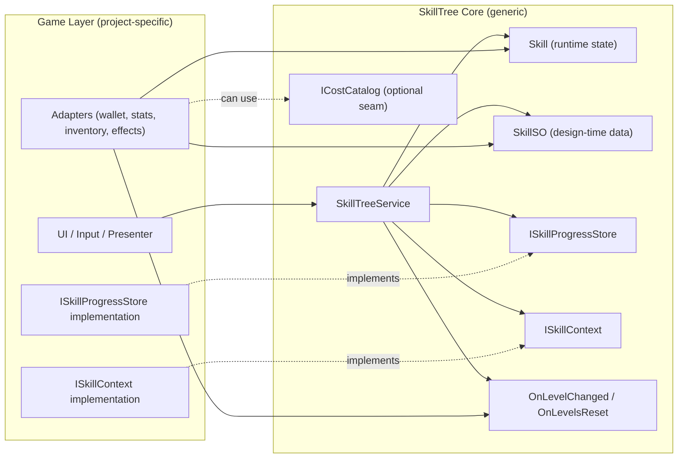

# Unity Skill Tree System

> A generic, data-driven, reusable Skill Tree module for Unity.

## Features

- Fully decoupled from game logic
- Data-driven (ScriptableObject based)
- Supports unlock + upgrade progression
- Multiple cost types
- Event-driven effect emission
- Pluggable persistence layer
- Designed for reuse across projects

## Architecture

The system is split into two layers:

- SkillTree Core (generic, reusable)
- Game Layer (project-specific implementation)




## Upgrade Flow

Upgrade flow:

1. Validate skill existence
2. Check prerequisites
3. Check max level
4. Validate cost via ISkillContext
5. Commit payment
6. Increase level
7. Save progression
8. Emit OnLevelChanged event

## Integration

To integrate into your game:

Implement interfaces from the generic layer:

```csharp
public sealed class GameSkillContext : ISkillContext
{
    // Bridge to wallet/stats/inventory systems in your game.
}

public sealed class SaveSkillProgressStore : ISkillProgressStore
{
    // Bridge to your save system (JSON, cloud save, player profile, etc.).
}
```

Wire service + event flow:

```csharp
var service = new SkillTreeService(skillDefinitions, context, progressStore);
service.OnLevelChanged += (skillId, newLevel) =>
{
    // React in game layer: UI refresh, audio feedback, telemetry, etc.
};
```

Map generic effects to game-specific behavior:

```csharp
// Core emits generic EffectDefinition; game decides meaning.
foreach (var effect in unlockedSkill.Effects)
{
    // Example: "DamageMultiplier" -> CombatStats.ApplyDamageMultiplier(...)
}
```

## Quick Start

Minimal integration flow:

- Create your `SkillSO` assets (ids, prerequisites, costs, effects).
- Implement `ISkillContext` and `ISkillProgressStore` in the game layer.
- Construct `SkillTreeService` with definitions + adapters.
- Subscribe to `OnLevelChanged` (and reset event if used) for UI/game reactions.
- Call upgrade API from UI/input flow.

```csharp
var service = new SkillTreeService(skillDefinitions, context, progressStore);
service.OnLevelChanged += (skillId, newLevel) => presenter.Refresh(skillId, newLevel);

// Example call site from UI button:
var result = service.TryUpgrade("combat.sword_mastery");
```

## Core API

Core types you usually touch:

- `SkillTreeService`: runtime entry point (query state, upgrade, reset, emit events).
- `SkillSO`: design-time definition for a skill node.
- `Skill`: runtime state for one skill (current level, availability, etc.).
- `ISkillContext`: adapter for validation/payment and other game-side checks.
- `ISkillProgressStore`: adapter for load/save progression.
- `OnLevelChanged` / `OnLevelsReset`: events emitted by core, consumed by game layer.

## Sample Skill Data

Conceptual example of one skill definition:

```json
{
  "id": "combat.sword_mastery",
  "maxLevel": 5,
  "prerequisites": ["combat.basic_training"],
  "costsPerLevel": [
    { "type": "Gold", "amount": 100 },
    { "type": "SkillPoint", "amount": 1 }
  ],
  "effectsPerLevel": [
    { "key": "DamageMultiplier", "value": 0.05 }
  ]
}
```

Use this only as a shape reference. Actual data lives in `SkillSO` assets.

## Persistence Contract

`ISkillProgressStore` should persist only progression state, typically:

- Skill id
- Current level

Expected lifecycle:

1. Load existing progression before gameplay uses the tree.
2. Save progression after upgrade/reset mutations.
3. Keep format independent from core internals so migration is manageable.

## Upgrade Result Semantics

Upgrade flow should produce deterministic outcomes, for example:

- `Success`: level increased and persisted.
- `PrerequisiteNotMet`: required skill/level missing.
- `Maxed`: already at cap.
- `CannotAfford`: context cannot pay current level cost.
- `TransactionFailed`: validation passed but commit/save failed.

Use a stable result contract so UI and telemetry can react consistently.

## Scope

What this module includes:

- Generic progression rules for unlock + upgrade
- Cost/effect abstraction hooks
- Event-based integration points
- Persistence seam via interface

What this module does not include:

- Game-specific UI/UX
- Concrete combat/stat/business logic
- Concrete economy/inventory implementation
- Concrete save backend

## License

This project is licensed under the MIT License - see the LICENSE file for details.